## UI Sketches ##

### Register Step1 : Verify Email ###

### Register Step2 : Verify Phone Number ###
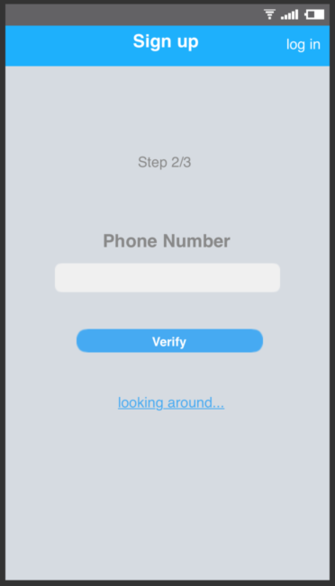
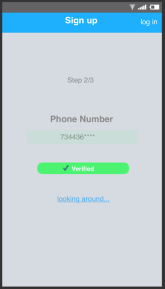

### Register Step3 : Confirm Password ###
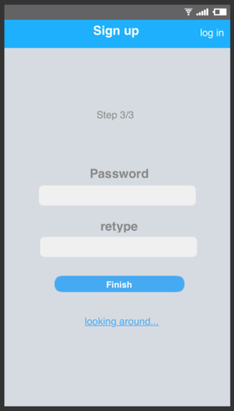
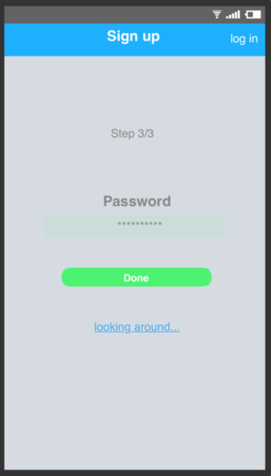

### Login ###
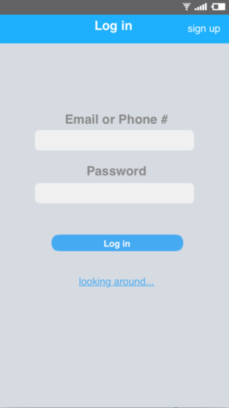

### Home: Top-level Departments ###
**Guest Mode** : Post, Selling, Wishes is **NOT** available.

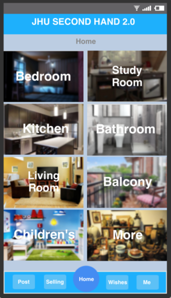

**User Mode** : Post, Selling, Wishes can be clicked.

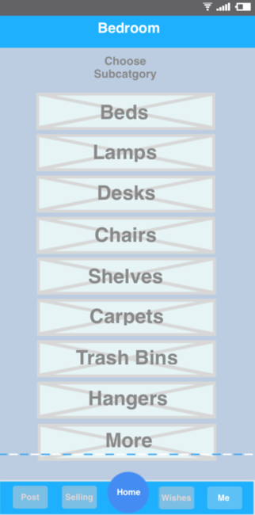

(Click 1 department: for example "Bedroom")

### Home: Second-level Categories ###

### Home: List Page ###

### Home: Detail Page ###

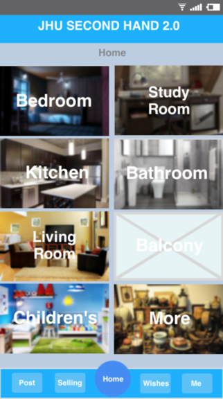

### Post: Add an Item for Sell ###

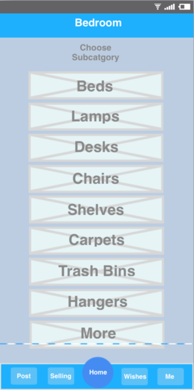

### Wishes: Wishlist ###

### Selling: List of Items on Selling ###

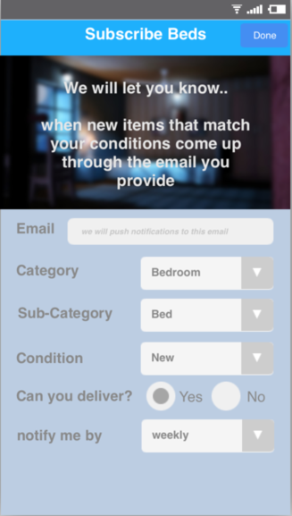

### Me: Manage Accont ###
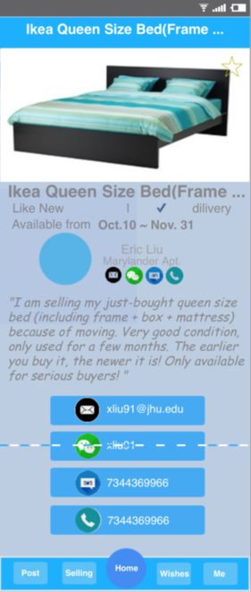

## User-case ##

### Guest sign up ###
1. Guest user opens app
2. Main page displays top-level departments together with 4 buttons (Post, Selling, Wishlist and Me) at the bottom of the page. All buttons except "Me" cannot be clicked, as user has not logged in.
3. User clicks "Me" button
4. Server directs user to login/register page
5. User clicks "create a new account"
6. Server directs user to register page
7. User enters username, password, email and phone number
   - If email has been registered, user will be directed back to register page, with a notification saying "The email has been registered!"
8. Server sends a verification email
9. User checks email and clicks verification link
10. Server sends a notification saying "Email verified."
11. Server sends a verification message to phone number
12. User checks message and enters verification code
13. Server sends a notification saying "Your account is created successfully."
13. User is redirected to main page, where "Post", "Selling", "Wishlist" buttons are lightened

### User log in ###
1. Existed user opens app
2. Main page displays top-level departments together with 4 buttons (Post, Selling, Wishlist and Me) at the bottom of the page. All buttons except "Me" cannot be clicked, as user has not logged in.
3. User clicks "Me" button
4. Server directs user to login/register page
5. User enters username and password, then clicks login button
   - If username and password match, user will be redirected to main page, where "Post", "Selling", "Wishlist" buttons are lightened
   - If username does not existed or username and password do not match, user will be directed back to login/register page, with an error notification saying "sign-in error"

### User wants to update personal information ###
1. User logs in successfully
2. User clicks "Me" button at the bottom-right corner of the page
3. Server displays the menu below: 
   - My profile
   - My wishlist
   - My sell
   - Help
4. User clicks "My profile" link
5. Server displays user's personal info., together with an "Edit" button at the upper-rigtht corner of the page
6. User clicks the "Edit" button
7. Server displays user's personal info. and a "Save" button at the bottom of the page. Here, each element is editable.
8. User updates personal info. and clicks "Save" when he/she finishes.
   - If email address or phone number is missing, user will be directed back to edit page with an error notification saying "Contact information cannot be missing."
   - Else, user will be directed to "My profile" view page

###Guest wants to see seller's contact information ###
1. Guest user opens app
2. Main page displays top-level departments together with 4 buttons (Post, Selling, Wishlist and Me) at the bottom of the page. 
3. Guest clicks a department (Bedroom)
4. Page displays a list of second-level categories (Beds, Mattresses, Lighting, and etc.)
4. Guest clicks a category
5. Page displays a list of item overview
5. Guest clicks an item to view detail info.
6. Server displays detail info. of an item, together with a link: "please login/register to see the seller's contact information"
7. Guest clicks link
8. Server directs user to login/register page
9. User enters JHU email and password to log in
10. Server checks email and password 
11. User is directed back to item detail page
12. Now the user is able to see the seller's contact information.

###Guest wants to add an item to wishlist ###
1. Guest clicks a second-level category
2. Server displays a list of item overview 
3. User clicks the star located at the upper-right corner to like an item (add the item to wishlist)
4. A login/register page pops up with a notification saying "You need to login to add this item to your wishlist."
5. User logs in or creates an account successfully 
6. User is directed back to item list page
7. User clicks star again to like the item
8. Server adds item to wishlist

### User wants to view/update wishlist ###
1. User logs in successfully
2. User clicks "My wishlist" button
3. Page displays the menu shown as below: 
   - My profile
   - My wishlist
   - My sell
   - Help
4. User clicks "My wishlist" link
5. Page displays a list of items the user liked before. A list item consists of:
   - furniture name
   - link to view furniture detail
   - "Delete" botton    
   
####view item detail####
1. User clicks link to view detail information of an item
2. Page displays item's detail info., including name, description, price, photo, time left, and etc. 

####remove item from wishlist####
1. User clicks "Remove" button of an item 
2. Server deletes the item from wishlist and directs user back to wishlist page.
3. Now the user is able to see that the item has been deleted 
    
### User wants to post an item for sell ###
1. User logs in successfully
2. User clicks "Me" button
3. Page displays menu shown below: 
   - My profile
   - My wishlist
   - My sell
   - Help
4. User clicks "My sell" link
5. Server displays a list of for-sell items together with a "New" botton at the page's upper-right corner 
6. User clicks "New item" button
7. A "create item" page pops up
7. User enters detail info. to create a new item
8. Server updates for-sell list, and directs user back to "My sell" list page.
9. Now the user is able to see that the new item has been added 

### User wants to view/update/remove a for-sell item###
1. User logs in successfully
2. User clicks "Me" button
3. Page displays menu shown as below: 
   - My profile
   - My wishlist
   - My sell
   - Help
4. User clicks "My sell" link
5. Server displays a list of for-sell items together with a "New item" botton. A list item consists of:
   - furniture name
   - link to view furniture detail
   - "Edit" botton
   - "Remove" botton
   
####view item detail####
1. User clicks link to view detail info. of an item
2. Server displays item's detail info., including name, description, price, photo, time left, and etc. 

####update item details####
1. User clicks "Edit" button of an item 
2. Page displays item's detail information and a "Save" button at bottom of page. Here, each element is editable.
3. User updates item's information and clicks "Save" when he/she finishes
4. Server updates item info. and directs user back to "My sell" page
5. Now the user is able to see that the item has been updated

####remove item from for-sell list####
1. User clicks "Remove" button of an item 
2. Server deletes item from for-sell list and directs user back to "My sell" page.
3. Now the user is able to see that the item has been deleted 

## 7. Architecture ##

Our project will adopt a model-view-presenter architecture to deal with the separation of concerns. 

The model layer employs Java to define the data and MySQL to build the database. Ionic will be used as the framework for the design of the view layer. 

In between, a presenter layer will be constructed with the help of the RxJava library. In addition, a SMS gateway such as Ozeki NG SMS Gateway and the Apache HttpComponents library are needed for our cell phone validation feature.

Last but not least, existing open source implementations of the Java Servlet, potentially Tomcat will be used to aid the development of our email verification feature.

 
