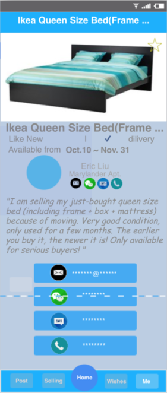
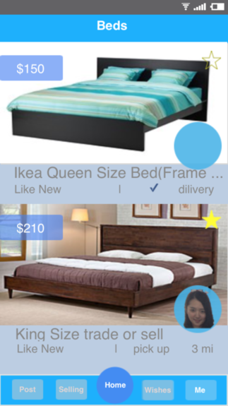
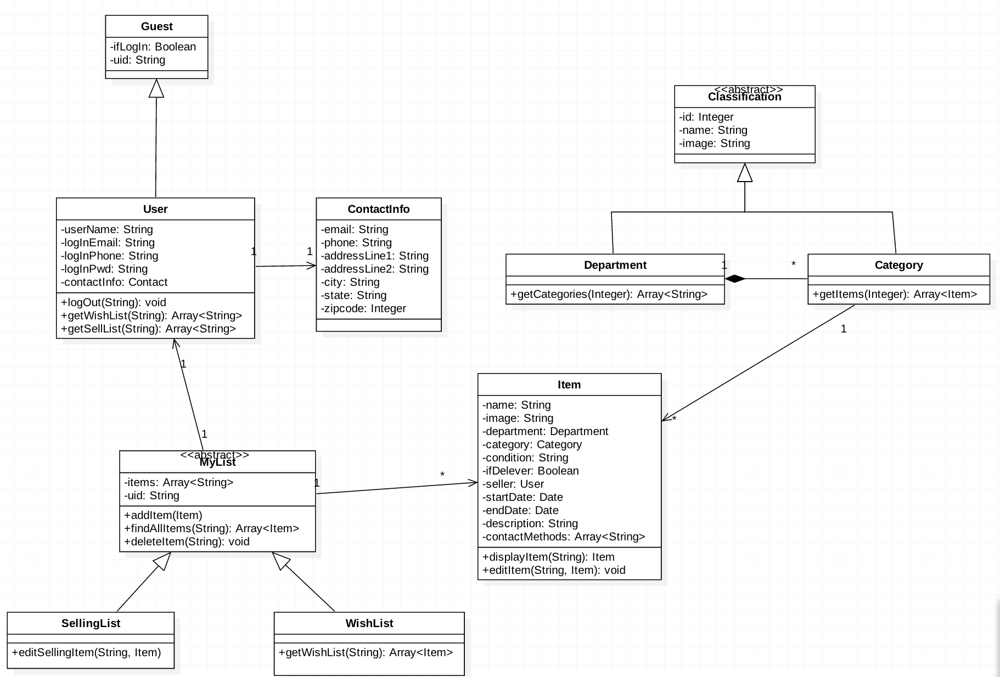
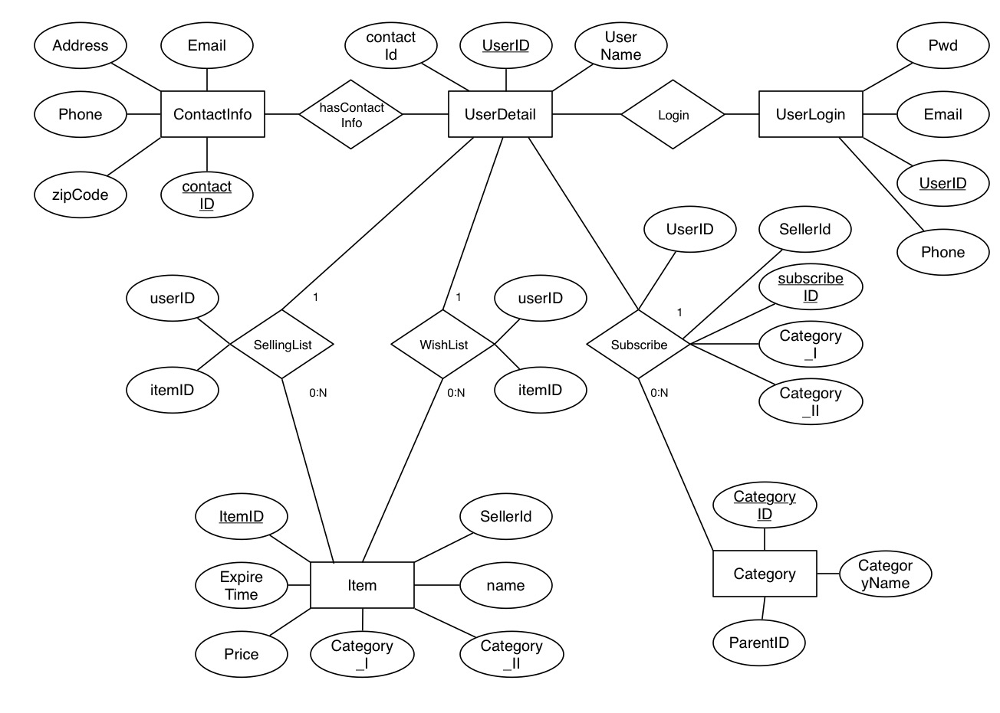
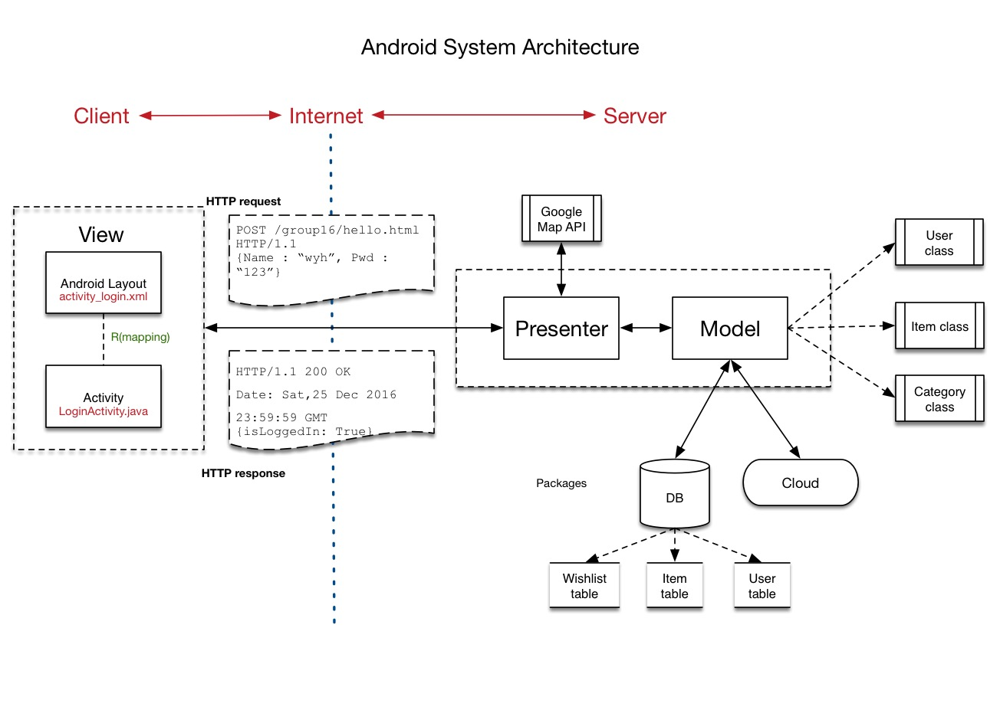

# OOSE Project

## Team Info
Yuhang Wang, Beinan Wang, Da Chen, Xiaoxiao Liu, Mengdan Zhang

## Overview
Our goal is to develop an used item trading app for the Johns Hopkins community.Allowing the users to find the desired items for the best price in a fast and convenient fashion will be our first priority, In addition, making the app a secure platform will also be our focus. Email and text verifications are required for successful registration. Thus, making sure sellers and buyers using the app are real. Besides the core functionality, extended features such as recommending items based on user's history will be added if we are ahead of our schedule.

## Feature List
1. A user shall be either in user mode or guest mode.
* Once the app is opened, the default mode for users is guest mode.
* A user shall be able to change mode between guest mode and user mode at anytime when he/she uses our app by logging in and logging out.
* A first-time user shall be able to register an account when using the app.
* When registering an account, the user shall provide his/her JHU email address, phone number and a password. Both the email address and the phone number need to be verified.
* A user shall be able to log in by using his/her email address and password.
* In user mode, a user shall have an account view.
* In user mode, a user shall be able to complete his/her personal info by entering his/her name, address and uploading a badge photo in his/her account view. 
* In user mode, a user shall be able to edit his/her name, address, password and profile photo in account view.
* In user mode, a user shall be able to change his/her phone number and re-verify it.
* A user shall be able to browse items through different departments.
* [Optional] A user shall be able to use the filter function to search for items that satsify specific conditions.
* [Optional] The user shall be able to use the search engine to find items.
* In guest mode, a user shall not be able to see another user's contact information and address.
* In user mode, a user shall be able to see others’ contact information and  address.
* In user mode, a user shall be able to post items in his/her account view.
* In user mode, a user shall be able to collect items, and be able to open his/her “Wish List” to manage the collected items.
* In user mode, a user shall have a selling list in his/her account view.
* To post a new item for sale, a user **must** be in user mode and must provide the following information: 
    * the name of the item
    * the category the item belongs to
    * the price
    * the date the item becomes available 
    * the expiration date of the item 
    * availability of delivery
    * the pick-up address
    * at least one photo of the item
    * an optional description
    * condition of the item
* Once an item is sold before its expiration date, the user shall be able to tag that item as unavailable.
* An item shall be tagged unavailable when it expires unless its owner extend its expiration date.
* In user mode, a user shall be able to delete his/her posted items.
* Our app shall be able to clean unavailable items regularly and automatically.
* [Optional] An item shall have an attribute to reflect how many people have liked it.
* [Optional] In user mode, a user shall be able to see his/her view history. 
* [Optional] Our app shall be able to recommend items to users via recommendation algorithm.

## UI Sketches ##

[Complete UI Design](./Project_Doc/UI.md)

Example:

+ Detail Page

	

+ List Page

	

## Classes UML ##

### UML

### Packages

In order to maintain high cohesion and high modularity, the classes are grouped into packages by feature. Our second-hand funiture trading app has the following packages:

- com.JHUFurniture.user
- com.JHUFurniture.item
- com.JHUFurniture.loginRegister
- com.JHUFurniture.verification
- com.JHUFurniture.subscribe
- com.JHUFurniture.filterSearch
- com.JHUFurniture.recommendation
- com.JHUFurniture.googleMap
- com.JHUFurniture.facebook

Each package contains all items related to the feature, from user-interface, to Java code, to database items. The details of each package  is as below:

- com.JHUFurniture.user
  * UI pages related to basic user activity like editing user information, displaying user's wishlist, selling list, and etc.
  * User.java - a Model object
  * SellingList.java - a Model object
  * Wishlist.java - a Model object
  * UserController.java - a controller object
  * UserService.java - a service object
  * database items (User, SellingList, Wishlist)
  
 
- com.JHUFurniture.item
  * UI pages related to posting a new item, displaying item information, and etc.
  * Item.java - a Model object
  * ItemController.java - a controller object
  * ItemService.java - a service object
  * database items (Item)
  

- com.JHUFurniture.signin
  * UI pages related to log in, log out
  * SigninRegisterController.java - a controller object
  * SigninRegisterService.java - a service object
  
  
- com.JHUFurniture.Register (use JavaMail, Nexmo/DIY-2FA)
  * UI pages related to registration
  * RegisterController.java 
  * RegisterService.java

- com.JHUFurniture.subscribe (use JavaMail)
  * UI pages related to customize a subscription request
  * Subscribe.java - a Model object
  * SubscribeController.java
  * SubscribeService.java
  * database items (Subscribe)
  * mail.HTML -  HTML framework of the email
   
- com.JHUFurniture.filterSearch
  * UI pages that allows user to select of set of checkboxes and then displays a list of items
  * filterController.java
  * filterService.java

- com.JHUFurniture.recommendation (use machine learning package: Weka)
  * precomputation.java - precompute a table of variables, which will be used by our recommendation alogrithm very  frequently, to avoid wasteful duplication of effort.
  * recommendation.java - contain recommendation algorithms  
 recommendation system only changes the order we display items. It uses the same UI and DB as them in item package.

- com.JHUFurniture.googleMap (use GoogleMap and MapFragment)
  * UI pages used to integrate google maps in our application in order to show item location on the map, and to calculate the distance between item's location and user's home address
  * mapController.java
  * mapService.java
 
- com.JHUFurniture.facebook (use Facebook4J library)
  * UI page that redirects user to the seller's facebook page

In summary, we decide to use sparkJava as the Java web framework, MySQL for the database in our andriod app. Helper libraries includes 

- Google Gson (JSON)
- JavaMail (email verification and subscription)
- Nexmo/DIY-2FA (phone number verification)
- Google maps (calculate distance between item and user)
- Facebook API
- Weka (recommendation system)

## Database Design ##

### E-R Model

### Schema

DROP TABLE UserDetail;
	CREATE TABLE UserDetail(
	   userId        INTEGER PRIMARY KEY     NOT NULL,
	   contactId	   INTEGER			 NOT NULL,
	   userName      VARCHAR(20) NOT NULL,
	   FOREIGN KEY (userId) REFERENCES UserLogin(userId)
	   FOREIGN KEY (contactId) REFERENCES ContactId(contactId)
	);
	
	DROP TABLE UserLogin;
	CREATE TABLE UserLogin(
		userId INTEGER PRIMARY KEY AUTOINCREMENT,
	  password    VARCHAR(50)   NOT NULL,
		email  VARCHAR(100)  NOT NULL
	);
	
	DROP TABLE ContactInfo;
	CREATE TABLE ContactInfo(
	   contactId   INTEGER PRIMARY KEY AUTOINCREMENT,
	   email       VARCHAR(100)  NOT NULL,
	   phone	     VARCHAR(13)	 NOT NULL,
	   address     VARCHAR(100)  NOT NULL,
	   zipCode		 VARCHAR(20)   NOT NULL
	);
	
	DROP TABLE Item;
	CREATE TABLE Item(
	    itemId          INTEGER PRIMARY KEY AUTOINCREMENT,
	    sellerId        INT                   NOT NULL,
	    name            VARCHAR(100)          NOT NULL,
	    description     TEXT,
	    imgPath         VARCHAR(100),
	    postDate        DATETIME,
	    avialableDate   DATETIME,
	    expireDate      DATETIME,
	    price           REAL CHECK(price > 0) NOT NULL,
	    category1       VARCHAR(20)           NOT NULL,
	    category2       VARCHAR(20)           NOT NULL,
	    isDeliver       BOOLEAN               NOT NULL,
	    condition       VARCHAR(10)           NOT NULL,
	    pickUpAddress   VARCHAR(100),
	    numOflikes      INT CHECK(numOflikes > 0)
	);
	
	DROP TABLE SellingList;
	CREATE TABLE SellingList(
		userId INT NOT NULL,
		itemId INT NOT NULL,
		CONSTRAINT pk_user_item  PRIMARY KEY(userId, itemId),
		FOREIGN KEY (userId) REFERENCES UserDetail(userId),
		FOREIGN KEY (itemId) REFERENCES Item(itemId)
	);
	
	DROP TABLE WishList;
	CREATE TABLE WishList(
		userId INT NOT NULL,
		itemId INT NOT NULL,
		CONSTRAINT pk_user_item PRIMARY KEY(userId, itemid),
		FOREIGN KEY (userId) REFERENCES UserDetail(userId),
		FOREIGN KEY (itemId) REFERENCES Item(itemId)
	);
	
	DROP TABLE Category;
	CREATE TABLE Category(
	  categoryId INTEGER PRIMARY KEY AUTOINCREMENT,
	  categoryName VARCHAR(50),
	  parentId INT NOT NULL,
	  FOREIGN KEY (parentId) REFERENCES Category(categoryId)
	);
	
	DROP TABLE Subscribe;
	CREATE TABLE Subscribe(
	  subscribeId INTEGER PRIMARY KEY AUTOINCREMENT,
	  userId INT NOT NULL,
	  sellerId INT NOT NULL,
	  category1 VARCHAR(50),
	  category2 VARCHAR(50),
	  FOREIGN KEY (userId) REFERENCES UserDetail(userId),
	  FOREIGN KEY (sellerId) REFERENCES UserDetail(userId)
	);

## API 

[Complete API Definition](./Project_Doc/API.md)

Example: Item List API

+ Method: **GET**   /item/itemList/:subCatId
+ Function: Display the items in that sub-level category.
   
+ Params:

        category2: <String>, the name of the sub-level category
   
+ Body:

        sessionId: <String>, the sessionId of the current user

+ Success: 200 (Success, OK)
   
+ Response:

		{
			itemShortcut: [
	           "name": "<String>",
	           "price": "<float>", 
	           "itemImgPath": "<String>", 
	           "isDeliver": "<boolean>", 	           
	           "sellerImgPath": "<String>", 
	           "distance": "<float>", 
	           "isLiked": "<boolean>"
	       ]
		}
	
	       
   
+ Failure:
       
    + 404: (Invalid sub-level category)

## System Architecture 

Our work include both **Client-Side** and **Server-Side** based on Model-View-Controller(Presentor) pattern. Client and server communicate based on HTTP.

#### Deployment: 

+ Frond-End: Android Emulator
+ Back-End: Github + Heroku + Travis

#### Client (View) : 

+ Include UI layout and reactful activities.
+ Send http request to server.
+ Receive http response and extract data out.

#### Server(Model + Controller) : 

+ Listen on 80 Port. Receive request and send response back.
+ Define the class methods and attributes.
+ Mapping database tables to model (logical classes).
+ manage database.

## Test Cases ##

### Test Coverage ###

|Package|	Class, %|	Method, %|	Line, %|
| -------------|:--------:| -----:|--------------:|
|all classes|	36.5% (19/ 52)|	19% (46/ 242)|	28% (360/ 1284)|

Coverage Breakdown

|Package|	Class, %|	Method, %|	Line, %|
| -------------|:--------:| -----:|--------------:|
|com.team16.project.Image|	20% (1/ 5)	|11.8% (2/ 17)	|4.3% (5/ 116)|
|com.team16.project.Item|	0% (0/ 4)|	0% (0/ 47)|	0% (0/ 83)|
|com.team16.project.ItemList|	0% (0/ 4)	|0% (0/ 42)	|0% (0/ 58)|
|com.team16.project.Login|	0% (0/ 2)	|0% (0/ 5)	|0% (0/ 8)|
|com.team16.project.Model|	87.5% (7/ 8)	|70.8% (17/ 24)	|57.1% (206/ 361)|
|com.team16.project.MyAccount|	33.3% (1/ 3)|	12.5% (1/ 8)|	7.7% (4/ 52)|
|com.team16.project.MyList.SellingList|	0% (0/ 4)	|0% (0/ 20)	|0% (0/ 271)|
|com.team16.project.MyList.WishList|	33.3% (1/ 3)	|44.4% (4/ 9)|	54.4% (43/ 79)|
|com.team16.project.User|	100% (2/ 2)	|24.1% (7/ 29)	|10.9% (7/ 64)|
|com.team16.project.core|	0% (0/ 2)	|0% (0/ 5)	|0% (0/ 23)|
|com.team16.project.registration.SecurityCode|	100% (3/ 3)|	100% (7/ 7)|	87.9% (29/ 33)|
|com.team16.project.registration.email|	33.3% (1/ 3)|	16.7% (1/ 6)|	20% (2/ 10)|
|com.team16.project.registration.password|	0% (0/ 2)|	0% (0/ 5)|	0% (0/ 8)|
|com.team16.project.registration.phone|	66.7% (2/ 3)|	50% (3/ 6)|	80.8% (21/ 26)|
|com.team16.project.subscribe	|25% (1/ 4)	|33.3% (4/ 12)	|46.7% (43/ 92)|

